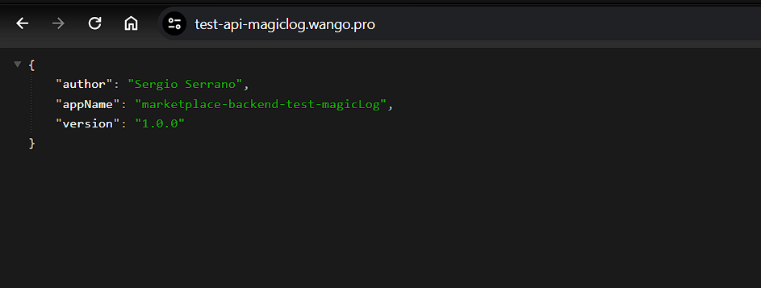
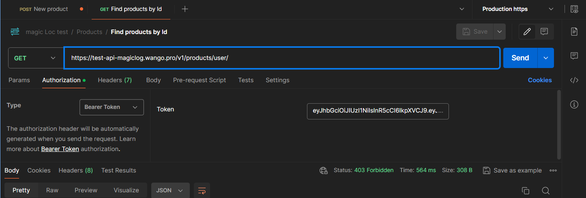

# MagicLog technical test

The backend application is built using Node.js and TypeScript, following a Model-View-Controller (MVC) architecture. The MVC structure segregates the application into Model (data layer), View (presentation layer), and Controller (logic layer), promoting code organization and separation of concerns.

Moreover, the backend codebase is designed with a strong emphasis on object-oriented and SOLID priciples, ensuring robutness, maintainability, and scalabilility.

()

## Directories structure ASCII

Cloning the repository will result in the following files:

```
.
├── config
│   └── Db.ts
├── dist
│   ├── config
│   │   └── Db.js
│   └── src
│       ├── App.js
│       ├── Repositories
│       │   ├── ProductRespositorie.js
│       │   └── UserRepositorie.js
│       ├── Server.js
│       ├── controllers
│       │   ├── AuthController.js
│       │   ├── ProductController.js
│       │   └── UserController.js
│       ├── index.js
│       ├── middleware
│       │   └── Authentication.js
│       ├── models
│       │   ├── Product.js
│       │   └── User.js
│       └── routers
│           ├── AuthRouter.js
│           ├── ProductRouter.js
│           ├── RootRouter.js
│           └── UserRouter.js
├── package-lock.json
├── package.json
├── src
│   ├── App.ts
│   ├── Repositories
│   │   ├── ProductRespositorie.ts
│   │   └── UserRepositorie.ts
│   ├── Server.ts
│   ├── controllers
│   │   ├── AuthController.ts
│   │   ├── ProductController.ts
│   │   └── UserController.ts
│   ├── index.ts
│   ├── middleware
│   │   └── Authentication.ts
│   ├── models
│   │   ├── Product.ts
│   │   └── User.ts
│   └── routers
│       ├── AuthRouter.ts
│       ├── ProductRouter.ts
│       ├── RootRouter.ts
│       └── UserRouter.ts
└── tsconfig.json
```

## Authentication

The authentications is based on JSON web tokens, token expires after one hour. The algorithm implemented is HMAC

```
jwt.sign(payload, process.env.JWT_SECRET as string, { expiresIn: "1h" })
```

### Endpoint to get a token

```
https://test-api-magiclog.wango.pro/v1/auth/login
```

## Protected Routes

To request to protected routes, use the bearear authorization header with the token obtained in the login.


### Payload

The payload is based on the next structure

```
{
  user: "unique identifier",
  email: "user email",
  role: "["user role"]" default to seller
}
```

## Scripts to run de application

In the project directory, you can run

### `npm dev`

Runs the app in the development mode.\
Open [http://localhost:50000](http://localhost:5000) to view it in the browser.

### `npm run build`

Builds the app for production to the `dist` folder.\
It correctly transpile .ts files to .js files.

## Deployment

The application is deployed on vps with the use of nginx as reverse proxy and pm2 as services manager.

```

server {
    listen 443 ssl;
    server_name test-api-magiclog.wango.pro;
    ssl_certificate /etc/letsencrypt/live/test-api-magiclog.wango.pro/fullchain.pem; # managed by Certbot
    ssl_certificate_key /etc/letsencrypt/live/test-api-magiclog.wango.pro/privkey.pem; # managed by Certbot


    location / {
        proxy_pass http://127.0.0.1:50000;
        proxy_set_header Host $host;
        proxy_set_header X-Real-IP $remote_addr;
        proxy_set_header X-Forwarded-For $proxy_add_x_forwarded_for;
        proxy_set_header X-Forwarded-Proto $scheme;
    }


}


```

# Functional Documentation

The entry point is https://test-api-magiclog.wango.pro/. The user can interact with the system with 2 types of roles: seller and admin.

## User stories

The application meets the following requirements


## Architecture diagram


## Database diagrma
The data is stored in MongoDB connected through mongoose, the database have the following structure:
-2 collections
-- Products
-- User
```
// User Model 
import { Schema } from "mongoose"
import mongoose from "mongoose"

export interface User extends Document {
  email: string
  password: string
  roles: string[]
}

const UserSchema = new Schema(
  {
    email: {
      type: String,
      required: true,
      unique: true,
    },
    password: {
      type: String,
      required: true,
    },
    roles: {
      type: [String],
      required: true,
      default: ["seller"],
    },
  },
  {
    timestamps: true,
  }
)
export const User = mongoose.model<User>("User", UserSchema)

```
## Roles

### Seller

When the user login on the application, the role assigned is Seller.

### Administrator

The admin role is asigned in the database.
